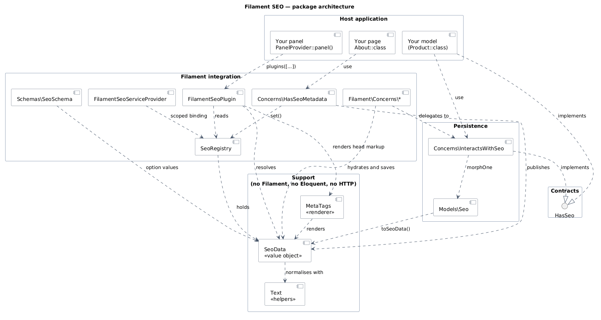
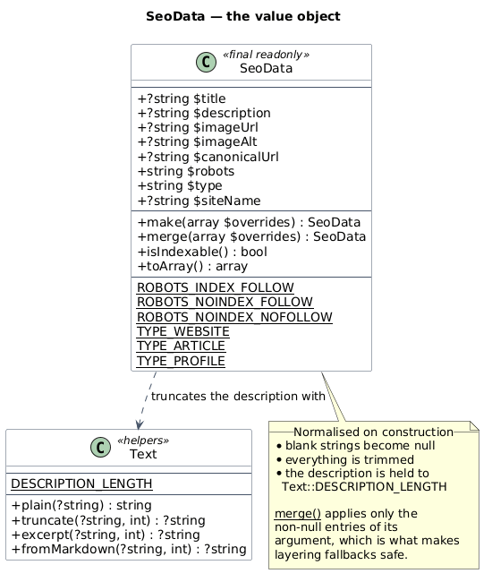
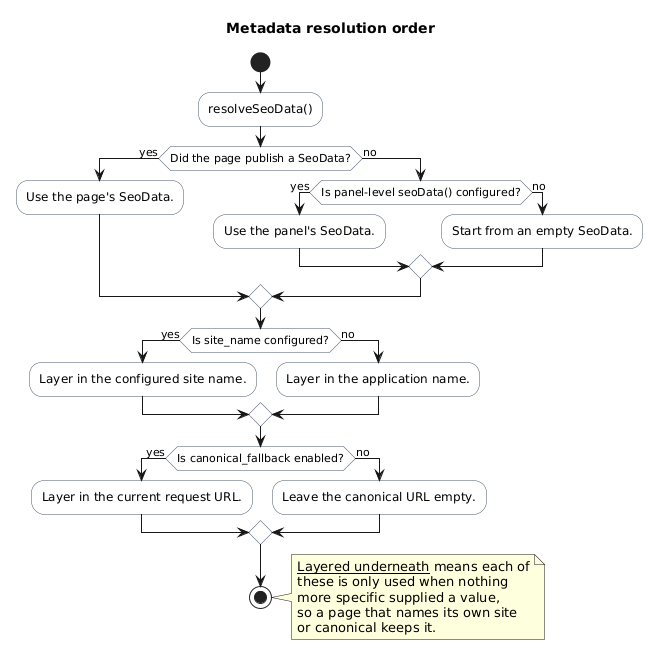

# Architecture

How the pieces fit together, and why they are arranged this way.



Source: [`diagrams/architecture.puml`](diagrams/architecture.puml)

## The shape of it

The package has exactly one real abstraction: `SeoData`. Everything else is either a way of
producing one, or a way of turning one into markup.

That boundary is the main design decision. `SeoData` knows nothing about Filament, Eloquent or
HTTP, which means the renderer can be tested without booting a panel, and every producer — a page,
a model, a plugin default — can be tested without rendering anything. Storage and rendering stay
outside the value object, so a change to either does not change the meaning of `SeoData`.

The two directories that know about the outside world sit on the edges:

- `Concerns/` and `Filament/` are the producers: they turn pages, records and form actions into
  `SeoData`.
- `Support/MetaTags` is the consumer: it turns `SeoData` into markup.

## `SeoData` — the value object



Source: [`diagrams/seo-data.puml`](diagrams/seo-data.puml)

`final readonly`, with no dependencies beyond the `Text` helpers. It normalises on construction:
values are trimmed, blank strings become `null`, and the description is held to
`Text::DESCRIPTION_LENGTH`. Anything rendering a `SeoData` can therefore trust it.

The method that makes layering work is `merge()`:

```php
public function merge(array $overrides): self
{
    return new self(
        title: $overrides['title'] ?? $this->title,
        // ...
    );
}
```

It applies **only the non-null entries** of its argument. That is what lets a base value be layered
underneath a more specific one without the specific one clobbering it — and, equally, what stops a
blank override from erasing an authored title.

## Metadata precedence



Source: [`diagrams/metadata-precedence.puml`](diagrams/metadata-precedence.puml)

The page wins. A panel default is the default for pages that publish nothing, and the site name and
canonical fallback are layered *underneath* both, so they only ever fill a gap.

Implemented as building a base and merging the more specific value on top:

```php
protected function resolveSeoData(): SeoData
{
    $published = $this->pageSeoData() ?? $this->panelSeoData();

    if ($published === null) {
        return $this->fallbackSeoData();
    }

    return $this->fallbackSeoData()->merge($published->toArray());
}
```

The direction matters. Reading it the other way round — merging the base *over* the page — looks
equivalent and is not: `merge()` applies non-null overrides, so a base with a `siteName` and a
canonical URL would overwrite both of a page's own values. That is a real bug, and it is now
covered by a test.

## Head rendering


Source: [`diagrams/head-rendering.puml`](diagrams/head-rendering.puml)

The one genuinely awkward part of integrating with Filament: the `<head>` render hook runs outside
the Livewire component's scope, so a page cannot be asked for its metadata at that point.

`HasSeoMetadata` publishes from `bootedHasSeoMetadata()` instead, and the render hook reads it back
from a scoped `SeoRegistry`. The registry is scoped rather than a singleton so that two panels — or a
panel and a queued job — cannot see each other's metadata.

## Authoring


Source: [`diagrams/authoring-flow.puml`](diagrams/authoring-flow.puml)

Two pipelines, converging on the same `saveSeo()`.

A resource page owns the record's lifecycle, so the package hooks the save and the `seo` array is
stripped out along the way. A modal action does not own it, so the host has to opt in explicitly:
`captureSeoFormData()` lifts the array out before the record is written,
`applyPendingSeoFormData()` writes it after.

The second path is more verbose, and that is the correct trade: a modal action's save behaviour is
the host's, not the package's, so the package does not guess at it.

## Storage


Source: [`diagrams/storage.puml`](diagrams/storage.puml)

One polymorphic table, so the package works with any model without knowing anything about it. Rows
are created lazily — a record that has never been given metadata has no row, and behaves exactly as
it did before the package was installed.

## Diagrams

All diagrams are authored in [PlantUML](https://plantuml.com) under [`diagrams/`](diagrams) and
rendered to PNG under `assets/diagrams/`. The PNGs are committed so GitHub displays them without a
render service, and CI verifies they are up to date:

```bash
composer diagrams          # render
bash bin/render-diagrams.sh --check   # fail if stale
```

The renderer is pinned to a specific PlantUML release and uses the Smétana layout engine, so
regenerating produces byte-identical output rather than diff noise from a different PlantUML or
Graphviz version.
