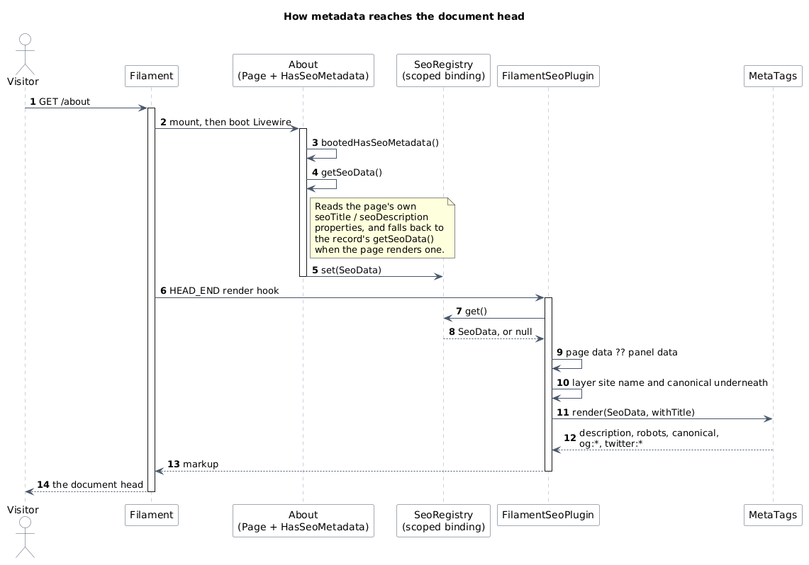
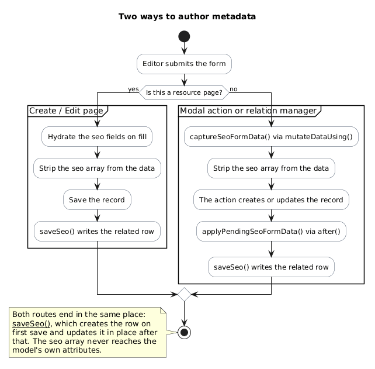

# Filament

Everything the package does inside a panel: panel-wide defaults, per-page metadata, resource forms
and modal actions.

## The plugin

```php
use DominionSolutions\FilamentSeo\FilamentSeoPlugin;

public function panel(Panel $panel): Panel
{
    return $panel
        ->plugins([
            FilamentSeoPlugin::make(),
        ]);
}
```

The plugin registers a single render hook at `PanelsRenderHook::HEAD_END` and injects the markup
there. That is the whole of its job: it works out the current `SeoData` and hands it to
`MetaTags::render()`.

### Panel-wide defaults

```php
FilamentSeoPlugin::make()
    ->seoData([
        'siteName' => 'Acme',
        'imageUrl' => asset('images/acme.png'),
        'imageAlt' => 'Acme',
    ]);
```

`seoData()` accepts a `SeoData`, an array of its named arguments, or a closure returning either:

```php
FilamentSeoPlugin::make()
    ->seoData(fn (): SeoData => new SeoData(
        siteName: tenant()->name,
        imageUrl: tenant()->logo_url,
    ));
```

A closure is evaluated per request, which is what you want for multi-tenant panels. Whatever you
configure here is a **default for pages that publish nothing** — it is never written over a page's
own metadata, and never over a record's.

### Rendering somewhere else

```php
FilamentSeoPlugin::make()
    ->renderHook(PanelsRenderHook::BODY_END);
```

Or disable injection entirely:

```php
FilamentSeoPlugin::make()
    ->renderHook(null);
```

## Pages

`HasSeoMetadata` gives a page its own title and description. Declare `$seoTitle` and
`$seoDescription` as string properties; override `getSeoTitle(): string|Htmlable` if the title needs
to be returned as an `Htmlable`.

```php
use DominionSolutions\FilamentSeo\Concerns\HasSeoMetadata;
use Filament\Pages\Page;
use Illuminate\Contracts\Support\Htmlable;

class About extends Page
{
    use HasSeoMetadata;

    protected static string $seoTitle = 'About Dominion Solutions';

    protected static string $seoDescription = 'Who we are and how we work.';

    protected ?string $heading = 'About us';
}
```

### Why `getTitle()` is overridden

The trait overrides `getTitle()` to return the SEO title, because that is the only way to control
what Filament puts in its own `<title>` element. This is deliberate, and it is why the package
defaults to `render_title => false`: the title is already in the head, and injecting a second one
would be actively harmful.

### Set `$heading` explicitly

Filament falls back to `getTitle()` for a page's *visible* heading. Since that is now the SEO title,
a page that renders a heading must set `$heading` (or override `getHeading()`) or the long SEO title
will appear in the page body. Note the `?string` type — Filament 5's `BasePage` declares
`protected ?string $heading = null`.

### What a page can set

Two properties cover most needs:

```php
protected static string $seoTitle = '...';
protected static string $seoDescription = '...';
```

The rest are methods, for values that need to be computed:

```php
use Illuminate\Contracts\Support\Htmlable;

public function getSeoTitle(): string|Htmlable { /* ... */ }

public function getSeoImageUrl(): ?string { /* ... */ }

public function getSeoImageAlt(): ?string { /* ... */ }

public function getSeoCanonicalUrl(): ?string { /* ... */ }

public function getSeoRobots(): ?string { /* ... */ }

public function getSeoType(): ?string { /* ... */ }
```

A page that edits a record can defer to it:

```php
use DominionSolutions\FilamentSeo\Support\SeoData;

public function getSeoData(): SeoData
{
    return $this->record->getSeoData();
}
```

### How the page reaches the render hook

Filament renders its `<head>` hooks outside the Livewire component's scope, so the page cannot simply
be asked for its metadata at that point. The trait publishes it from a lifecycle hook instead, and
the render hook reads it back from a scoped registry:



Source: [`diagrams/head-rendering.puml`](diagrams/head-rendering.puml)

## Resource forms

### The schema

`SeoSchema::make()` returns a `Section` with all six fields. Add it to a resource form:

```php
use DominionSolutions\FilamentSeo\Schemas\SeoSchema;
use Filament\Schemas\Schema;

public static function form(Schema $schema): Schema
{
    return $schema
        ->components([
            // ...your own fields
            SeoSchema::make(),
        ]);
}
```

That is the Filament 5 resource API. On Filament 4, resources use `Filament\Forms\Form` and
`schema()` instead:

```php
use DominionSolutions\FilamentSeo\Schemas\SeoSchema;
use Filament\Forms\Form;

public static function form(Form $form): Form
{
    return $form->schema([
        // ...your own fields
        SeoSchema::make(),
    ]);
}
```

It is `final`, by design — extending it would tie this package to a Filament version. Compose it
alongside your fields, or build your own section from the individual field helpers
(`SeoSchema::titleField()`, `::robotsField()`, and so on) if you want a different layout.

You can also control the section itself:

```php
SeoSchema::make(
    heading: 'Search engines',
    description: 'How this page appears in search results.',
);
```

### Create and edit pages

```php
use DominionSolutions\FilamentSeo\Filament\Concerns\CreatesSeoMetadata;
use Filament\Resources\Pages\CreateRecord;
use Filament\Resources\Pages\CreateRecord;

class CreateProduct extends CreateRecord
{
    use CreatesSeoMetadata;
}
```

```php
use DominionSolutions\FilamentSeo\Filament\Concerns\UpdatesSeoMetadata;
use Filament\Resources\Pages\EditRecord;
use Filament\Resources\Pages\EditRecord;

class EditProduct extends EditRecord
{
    use UpdatesSeoMetadata;
}
```

`UpdatesSeoMetadata` also loads existing values on fill. A create page needs no loading — a new
record has no authored metadata.

## Modal actions

Modal actions are a different pipeline. A resource page owns the record's lifecycle, so the package
hooks into the save. A `CreateAction` does not own it: the form state is handed to the action, so
the `seo` array has to be lifted out **before** the record is written and applied **after** the
record exists.



Source: [`diagrams/authoring-flow.puml`](diagrams/authoring-flow.puml)

```php
use DominionSolutions\FilamentSeo\Filament\Concerns\InteractsWithSeoActions;
use DominionSolutions\FilamentSeo\Schemas\SeoSchema;
use Filament\Actions\CreateAction;
use Filament\Resources\RelationManagers\RelationManager;
use Filament\Tables\Table;
use Illuminate\Database\Eloquent\Model;

class SeoRelationManager extends RelationManager
{
    use InteractsWithSeoActions;

    // This must be a relationship on the owning model, not the package's seoable morph.
    protected static string $relationship = 'caseStudies';

    public function table(Table $table): Table
    {
        return $table
            ->headerActions([
                CreateAction::make()
                    ->form([SeoSchema::make()])
                    ->mutateDataUsing($this->captureSeoFormData(...))
                    ->using(function (array $data): Model {
                        $record = new ($this->getModel());
                        $record->fill($data);
                        $this->getRelationship()->save($record);

                        $this->applyPendingSeoFormData($record);

                        return $record;
                    }),
            ]);
    }
}
```

On edit actions, load the existing values with `fillSeoFormData()`:

```php
use Filament\Actions\EditAction;
use Illuminate\Database\Eloquent\Model;

EditAction::make()
    ->form([SeoSchema::make()])
    ->fillForm($this->fillSeoFormData(...))
    ->mutateDataUsing($this->captureSeoFormData(...))
    ->using(function (Model $record, array $data): Model {
        $record->update($data);

        $this->applyPendingSeoFormData($record);

        return $record;
    }),
```

Note the `seo` array never reaches the model's own attributes — `captureSeoFormData()` removes it,
and `applyPendingSeoFormData()` writes it to the related row.
