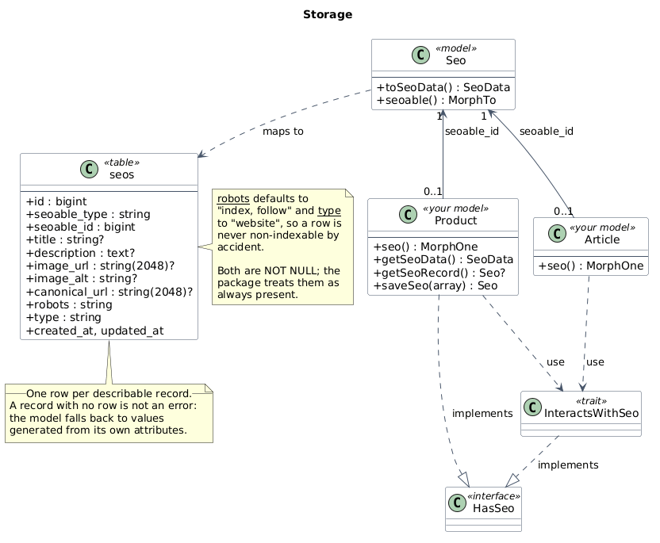

# Models

A model that can describe itself is what stops a panel from being invisible. This page is the
reference for `InteractsWithSeo`, the `HasSeo` contract, and the fallbacks used when nothing has
been authored yet.

## The setup

```php
use DominionSolutions\FilamentSeo\Concerns\InteractsWithSeo;
use DominionSolutions\FilamentSeo\Contracts\HasSeo;
use Illuminate\Database\Eloquent\Model;

class Product extends Model implements HasSeo
{
    use InteractsWithSeo;
}
```

Two pieces, and both are needed:

- **`use InteractsWithSeo`** provides the behaviour.
- **`implements HasSeo`** is the contract that makes the behaviour nameable. The trait carries an
  `@phpstan-require-implements HasSeo` annotation, so without it your IDE and Larastan will report
  calls to `getSeoData()` as undefined on a plain `Model`.

`seo()` is deliberately not part of the contract — see [Why the contract exists](#why-the-contract-exists).

## The API

```php
$product->seo;                  // MorphOne<Seo, $this>
$product->getSeoRecord();       // ?Seo — the authored row, or null
$product->getSeoData();         // SeoData — the effective value
$product->saveSeo([...]);       // create or update the authored row
```

### `getSeoData()`

The effective metadata: authored values layered over generated fallbacks, as a
[`SeoData`](architecture.md#seodata--the-value-object). This is the value the rest of the package
consumes, and it is never `null` — a record with no authored metadata still describes itself.

### `getSeoRecord()`

The authored `Seo` row, or `null` when nothing has been authored. Use this when you need to know
whether a human has actually curated the record, for example to show an "SEO needs attention"
badge.

### `saveSeo(array $attributes)`

Creates the row on first call and updates it in place afterwards. Only the keys you pass are
applied; anything omitted keeps its current value, so you can update a single field without
re-sending the rest.

```php
$product->saveSeo(['title' => 'A better title']);
```

## Generated fallbacks

When a record has no authored row, `getSeoData()` builds one from the record itself. By default it
sniffs the first non-blank string among these attributes:

| Field | Attributes checked, in order |
| --- | --- |
| Title | `name`, `title`, `headline` |
| Description | `description`, `summary`, `excerpt`, `tagline`, `body`, `content` |
| Share image URL | `og_image_url`, `image_url`, `share_image_url` |

Descriptions are reduced to plain text and held to `Text::DESCRIPTION_LENGTH` (160 characters), so
a long body attribute or a block of HTML cannot produce a broken meta description.

## Overriding the fallbacks

The trait reads through six `protected` methods. Override any of them to take control:

```php
use DominionSolutions\FilamentSeo\Support\SeoData;

class Product extends Model implements HasSeo
{
    use InteractsWithSeo;

    protected function getSeoFallbackTitle(): ?string
    {
        return $this->name;
    }

    protected function getSeoFallbackDescription(): ?string
    {
        return $this->tagline;
    }

    protected function getSeoFallbackImageUrl(): ?string
    {
        return $this->screenshot_url;
    }

    protected function getSeoFallbackImageAlt(): ?string
    {
        return 'A screenshot of '.$this->name;
    }

    protected function getSeoFallbackCanonicalUrl(): ?string
    {
        return route('products.show', $this);
    }

    protected function getSeoFallbackType(): ?string
    {
        return SeoData::TYPE_WEBSITE;
    }
}
```

Note that these are *fallbacks*. Once an editor authors a title for the record, the authored title
wins; the override only applies while the field is blank.

## The `seos` table

One polymorphic row per describable record.



Source: [`diagrams/storage.puml`](diagrams/storage.puml)

A record with no row is not an error — it is the normal state for a record nobody has curated yet,
and it is why you can adopt the package without a backfill.

`robots` and `type` are `NOT NULL` and default to `index, follow` and `website`, so a row is never
non-indexable by accident. Both are exposed as constants on `SeoData`:

```php
use DominionSolutions\FilamentSeo\Support\SeoData;

SeoData::ROBOTS_INDEX_FOLLOW;      // 'index, follow'
SeoData::ROBOTS_NOINDEX_FOLLOW;    // 'noindex, follow'
SeoData::ROBOTS_NOINDEX_NOFOLLOW;  // 'noindex, nofollow'

SeoData::TYPE_WEBSITE;
SeoData::TYPE_ARTICLE;
SeoData::TYPE_PROFILE;
```

## Type hints in your own code

Because `HasSeo` is a real interface, you can type hint a describable model without falling back to
a runtime check:

```php
use DominionSolutions\FilamentSeo\Contracts\HasSeo;

function metaFor(HasSeo $record): string
{
    return $record->getSeoData()->title ?? '';
}
```

## Why the contract exists

`seo()` is intentionally **not** part of `HasSeo`. An interface cannot know which model it will be
mixed into, so naming the declaring model in a generic would make the contract narrower than the
trait that implements it. The trait declares the precise relation instead:

```php
/** @return MorphOne<Seo, $this> */
public function seo(): MorphOne
```

If you need to reach the relation from a `HasSeo`-typed value, add `getSeoRecord()` and
`saveSeo()` — both are on the contract — or narrow to the concrete model first.
